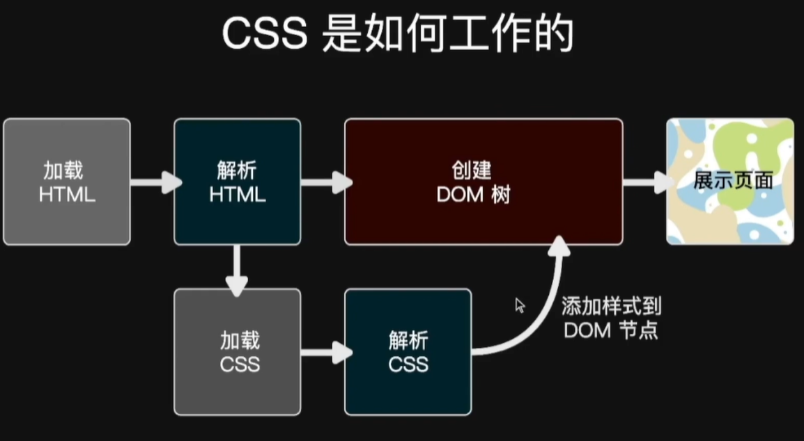
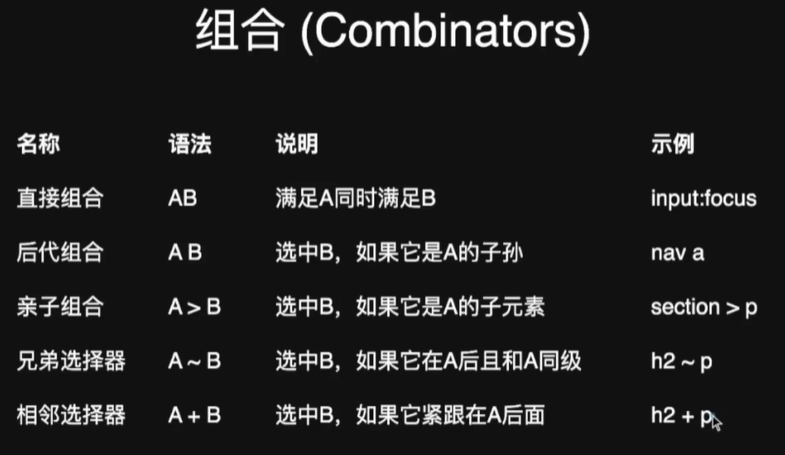
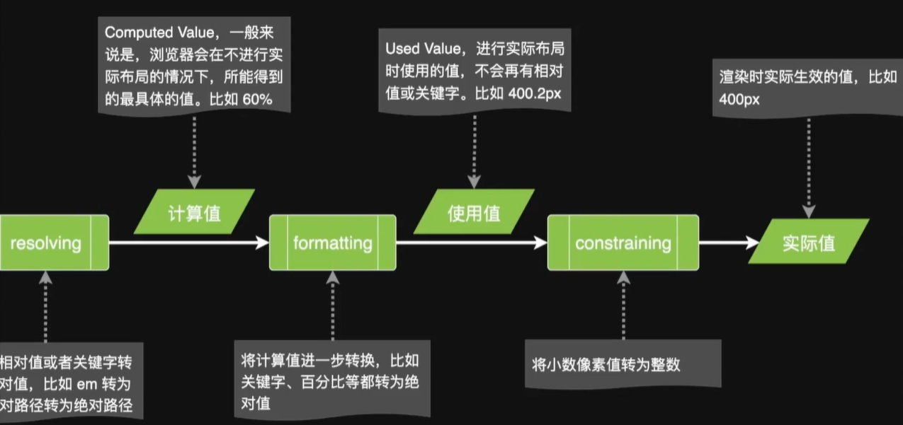
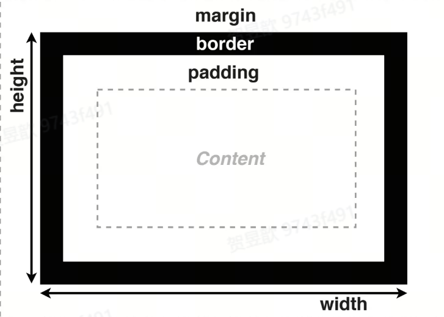
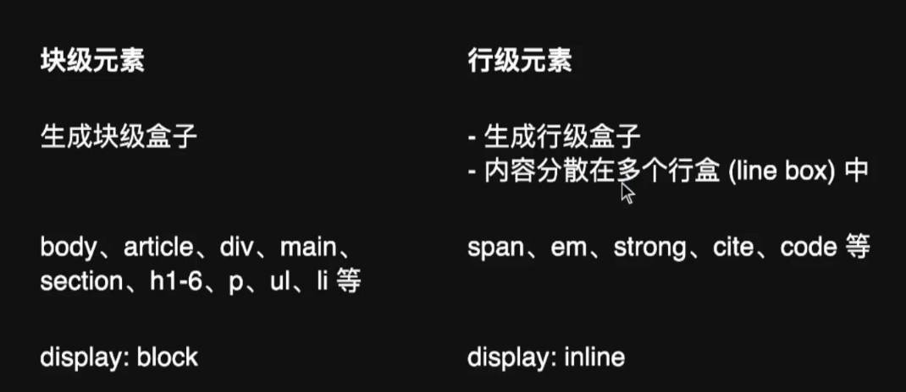
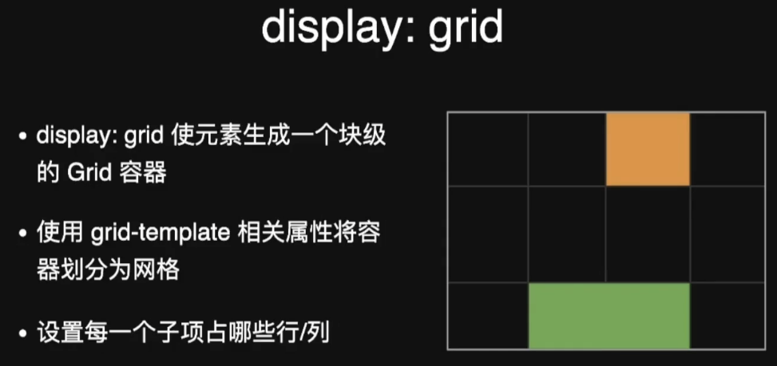
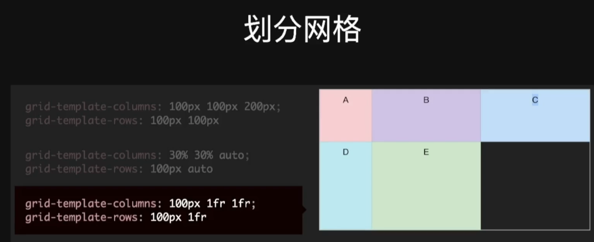
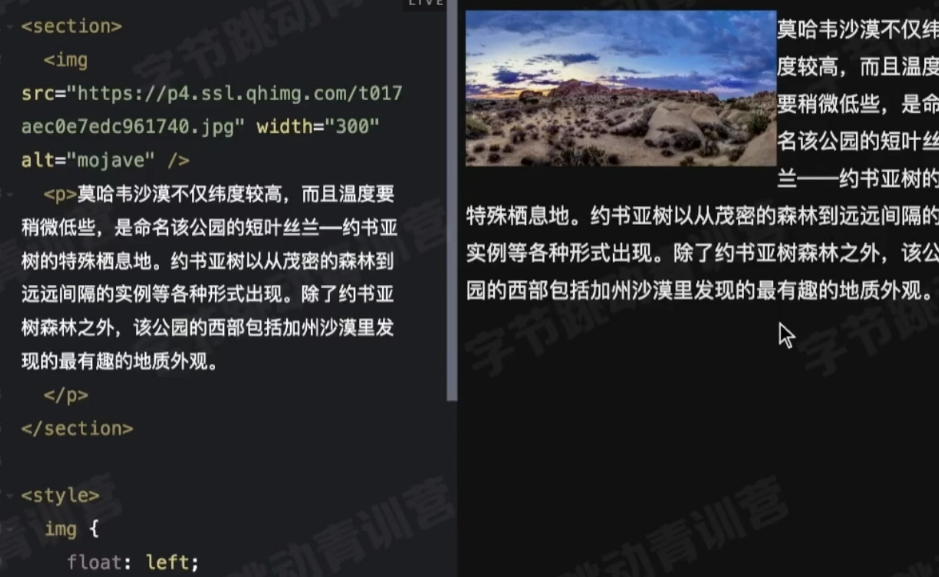
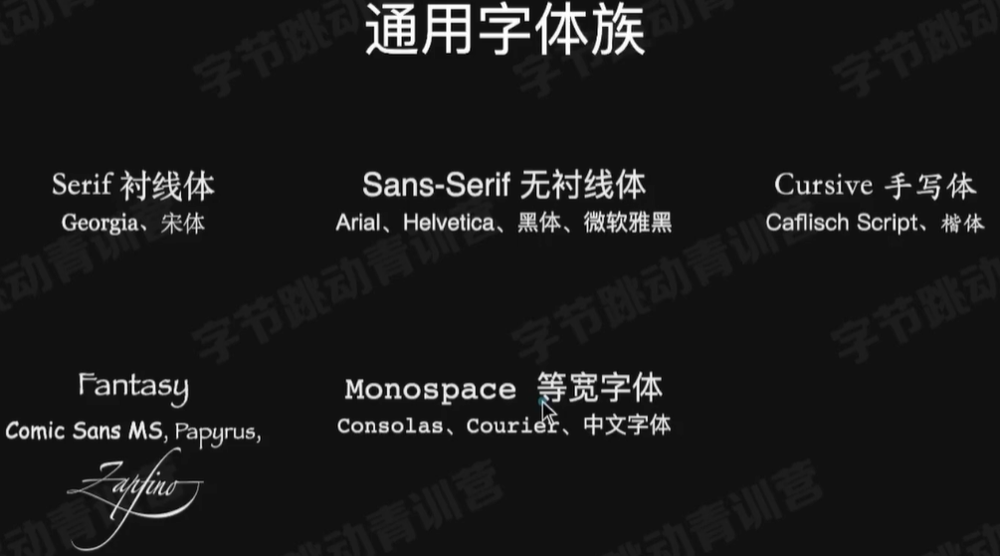

# CSS三节课深入学习

## 走进前端技术栈-CSS

CSS Cascading Style Sheets 层叠样式表
选择器，属性值，声明
例子：

```css
h1 {
    color: red;
}
```

### 在页面中使用CSS

1. 内联样式：在标签中使用style属性

    ```html
    <h1 style="color: red;">Hello World</h1>
    ```

2. 嵌入样式：在head标签中使用style标签

    ```html
    <head>
        <style>
            h1 {
                color: red;
            }
            p {
                margin: lem 0;
            }
            li {
                list-style: none;
            }
        </style>
    </head>
    ```

3. ⭐外链样式：在head标签中使用link标签

    ```html
    <head>
        <link rel="stylesheet" href="style.css">
    </head>
    ```

### CSS是如何工作的

1. 浏览器解析HTML文件，生成DOM树
2. 浏览器解析CSS文件，生成CSSOM树
3. 浏览器将DOM树和CSSOM树合并，生成渲染树
4. 浏览器根据渲染树，计算每个节点的位置和大小
5. 浏览器将渲染树绘制到屏幕上


### 选择器类型

1. 标签选择器 //h1, p, div
2. 通配符选择器 //*
3. 类选择器 //出现多次的元素可以使用类选择器
4. ID选择器 //每个元素只能有一个ID选择器
5. 属性选择器 //input[type="text"],用中括号包裹，用等号连接属性和值

    ```css
    <label>用户名：</label>
    <input value="zhao" disabled />

    <style>
        [disabled] {
            background-color: #ccc;
        }
    </style>

    //根据属性是某个特定的值来选择元素
    <label>密码：</label>
    <input type="password" value="123" />

    <style>
        input[type="password"] {
            border-color: red;
            color: red;
        }
    </style>

    //也可以对属性做一个特定的匹配，比如以某个特定的字符串开头
    <p><a href="#top">回到顶部</a></p>
    <p><a href="a.jpg">查看图片</a></p>

    <style>
        a[href^="#"] {//以#开头
            color: #f54767;
            background: 0 center/lem url("arrow-up.png") no-repeat;
            padding-left: 1.5em;
        }
        a[href$=".jpg"] {//以.jpg结尾
            color: deepskyblue;
            background: 0 center/lem url("icon.png") no-repeat;
        }
        a[href*="jpg"] {//包含jpg
            color: red;
        }
    </style>
    ```

6. 伪类选择器（不基于标签和属性定位元素。有几种伪类：状态伪类，结构性伪类）
    * 状态伪类：hover, active, focus, checked, disabled, enabled, selected
  
    ```css
    <a href="http://example.com">example.com</a>

    <label>
        <input type="text" />
    <label>

    <style>
    a:link {
        color:rgb(15, 15, 15);
    }
    a:visited {
        color:gray;
    }
    a:hover {
        color:orange;
    }
    a:active {
        color:red;
    }

    :focus { //获取焦点，焦点是一个元素的状态，通常是鼠标点击或者键盘按下
        outline: 2px solid orange;
        border-color: #58a;
        box-shadow: 0 0 5px rgba(88, 170, 255, .5);
    }
    ```

    * 结构性伪类：first-child, last-child, nth-child, nth-last-child, first-of-type, last-of-type, nth-of-type, nth-last-of-type

    ```css
    <ul>
        <li>1</li>
        <li>2</li>
        <li>3</li>
        <li>4</li>
        <li>5</li>
    </ul>
    <style>
        li:first-child {
            color: red;
        }
        li:last-child {
            color: blue;
        }
        li:nth-child(2) {
            color: green;
        }
        li:nth-last-child(2) {
            color: yellow;
        }
        li:first-of-type {
            color: red;
        }
    </style>
    ```

7. 组合选择器（多个选择器组合在一起使用）
    组合：
    比如用>，表示父子关系，用空格表示后代关系，用+表示相邻兄弟关系，用~表示后面所有兄弟关系

8. 选择器组合用**逗号**隔开，比如h1, p, div；

9. 选择器的特异度（Specificity）

    `<btn>`和`<btn primary>`, 怎么判断哪个更具体
    特异度的计算规则：

    1. 内联样式：1000
    2. ID选择器：100
    3. 类选择器：10
    4. 标签选择器：1
    5. 通配符选择器：0
    6. !important：1000000

    ```css
    <button class="btn">普通按钮</button>
    <button class="btn primary">主要按钮</button>
    <style>
    .btn {
        display: inline-block;
        padding: .36em .8em;
        margin-right: .5em;
        line-height: 1.5;
        text-align: center;
        cursor: pointer;
        border-radius: .3em;
        border: none;
        background: #e6e6e6;
        color: #333;
    }
    .btn.primary {
        color: #fff;
        background: #218de6;
    }
    </style>
    //这里.btn.primary的特异度为002，.btn的特异度为001，所以.btn.primary更具体。
    ```

    在 CSS（层叠样式表）的选择器上下文中，“特异度”（Specificity）是用来决定当多个选择器应用到同一个元素时，哪个选择器的样式会最终生效的一种计算规则。特异度越高，该选择器的样式就越优先应用。
    这里提到的 “.btn.primary 的特异度为 002 ，.btn 的特异度为 001” ，意味着：
    .btn 选择器：它是一个类选择器，根据 CSS 特异度计算规则，类选择器的特异度为 10 。所以 “.btn” 的特异度值这里写为 001（通常特异度用从左到右权重依次递减的数字表示，这里用三位数方便和其他更复杂选择器特异度对比） 。
    .btn.primary 选择器：它包含两个类选择器 “.btn” 和 “.primary” 。由于每个类选择器特异度为 10，两个类选择器组合，特异度就是 10 + 10 = 20 ，这里写为 002 。
    说 “.btn.primary 更具体” ，是因为它的特异度更高。这表明当 HTML 元素同时匹配 “.btn” 和 “.btn.primary” 这两个选择器时（比如一个元素有两个类名，像 \<button class="btn primary">）， “.btn.primary” 选择器定义的样式会优先于 “.btn” 选择器定义的样式应用到该元素上，因为它更具体地指向了同时具有这两个类名的元素，而 “.btn” 选择器指向的是所有具有 “btn” 类名的元素，范围更广。

### 初始值

CSS属性的初始值是指当属性没有被显式设置时，它会自动应用的默认值。

* CSS 中，每个属性都有一个初始值：比如background-color的初始值为 transparent；margin-eft 的初始值为 0
* 可以使用 initial 关键字显式**重置**为初始值：background-color:initial

### 继承

CSS属性的继承是指当一个元素的属性没有被显式设置时，它会自动继承其父元素的计算值。
继承：某些属性会自动继承其父元素的计算值，除非显式指定一个值。

* 显示继承：有一些属性是不可继承的，比如

        ```css
        * {
        box-sizing: inherit;
        } //这里的 * 选择器会选中页面上的所有元素，并将它们的 box-sizing 属性设置为 inherit。这意味着所有元素都会继承其父元素的 box-sizing 属性值
        html {
        box-sizing: border-box;
        } //这里的 html 选择器会选中页面的根元素 <html>，并将其 box-sizing 属性设置为 border-box。这意味着所有元素的默认 box-sizing 属性值将是 border-box，除非它们显式地设置了其他值。
        .some-widget {
        box-sizing: content-box;
        }
        //这里.some-widget的box-sizing属性是content-box，所以它的box-sizing属性是不可继承的。
        ```

### CSS求值过程

1. 计算初始值
2. 计算继承值
3. 计算指定值
4. 计算最终值
5. 应用最终值

继承是一种特殊的计算过程，它会在计算指定值之前，先计算继承值。继承的是父元素的**计算值**。


### 布局相关

1. 布局相关技术：常规流（行级 块级 表格布局 FlexBox Grid布局），浮动，绝对定位，固定定位
2. 基础的盒模型：content box, border box, margin box，content box的宽高由width和height指定，border box的宽高由padding和border指定，margin box的宽高由margin指定。
   * weight 和 height 指定content box的宽高，取值为长度、百分比、auto；但是height是容器有指定的高度时，百分数才生效，Width 是相对于容器的context box的宽度 
   * padding 指定内边距，取值为长度、百分比、auto；padding会增加元素的总宽高
   * border 指定边框，取值为长度、百分比、auto；border会增加元素的总宽高
   * margin 指定外边距，取值为长度、百分比、auto；margin会增加元素的总宽高
   * 如果想展示一个有颜色的三角形步骤是：
        1. 定义一个div元素
        2. width和height属性设置为0
        3. 定义一个border属性，比如border: 50px solid transparent;
        4. 定义一个border-top-color属性，比如border-top-color: red;
        5. 定义一个border-bottom-color属性，比如border-bottom-color: blue;
         ```css
        <div class="triangle"></div>
        <style>
        .triangle {
            width: 0;
            height: 0;
            border: 50px solid transparent;
            border-top-color: red;
            border-bottom-color: blue;
        }
        </style>
        ```
   * margin collapse：相邻的两个元素的margin会发生合并，合并后的margin是两个margin中较大的那个。
      * 比如margin-top和margin-bottom会发生合并，合并后的margin是两个margin中较大的那个。margin-top = 100px, margin-bottom = 100px, 合并后的margin = 100px
   * border-sizing：指定元素的盒模型是content-box还是border-box
      * content-box：**默认值**，指定元素的盒模型是content-box，元素的宽高是content box的宽高
      * border-box：指定元素的盒模型是border-box，元素的宽高是border box的宽高;需要设置`boder-sizing: border-box`;
      * 
   * overflow：指定元素的内容是否溢出，如果溢出，会出现滚动条
      * visible：默认值，内容不会被裁剪，会出现滚动条
      * hidden：内容会被裁剪，不会出现滚动条
      * scroll：内容会被裁剪，会出现滚动条  

3. 块级 vs. 行级
   * 块级元素（Block Level Box）：会独占一行，宽度默认是父元素的100%，高度默认是内容的高度，padding和border会将元素撑开。
   * 行级元素（Inline Level Box）：不会独占一行，宽度默认是内容的宽度，高度默认是行高，padding和border不会将元素撑开。
    
   * display属性：block, inline, inline-block, none
   * FlexBox：Flexible Box Layout，是一种一维的布局模型，它可以在不同的方向上对齐元素，并且可以动态地调整元素的大小。
   * justify-content：**水平方向**上的对齐方式
      * flex-start：默认值，元素向行首对齐
      * flex-end：元素向行尾对齐
      * center：元素居中对齐
      * space-between：元素平均分布在该行上
      * space-around：元素平均分布在该行上，两端保留一半的空间
   * align-items：**垂直方向**上的对齐方式
      * flex-start：元素向列首对齐
      * flex-end：元素向行尾对齐
      * center：元素居中对齐
      * baseline：元素的基线对齐
      * stretch：默认值，如果元素未设置高度或者设为auto，将占满整个容器的高度
   * flex：flex-grow, flex-shrink, flex-basis的缩写
       * flex-grow：元素的放大比例，默认为0，即如果存在剩余空间，也不放大
       * flex-shrink：元素的缩小比例，默认为1，即如果空间不足，该元素将缩小
       * flex-basis：元素的初始大小，默认为auto，即元素的原始大小
   * flex-direction：指定元素的排列方向
      * row：默认值，元素按照水平方向排列
      * row-reverse：元素按照水平方向相反的方向排列

   * Grid布局：Grid Layout，是一种二维的布局模型，它可以将元素放置在一个网格中，并且可以控制每个元素的大小和位置。
   
   * 1fr = 1 fraction，即一个分数单位，1fr表示一个分数，1fr 1fr 1fr 表示三个分数，每个分数占一行的1/3
   
   * grid-template-columns：指定列的大小，用空格隔开，比如grid-template-columns: 1fr 1fr 1fr;
   * grid-template-rows：指定行的大小，用空格隔开，比如grid-template-rows: 1fr 1fr 1fr;
   * grid-areas：指定网格的区域。
   * grid-template-areas：指定网格的区域
   ```css
   
   .a {
        grid-row-start: 1;
        grid-row-end: 3;
        grid-column-start: 1;
        grid-column-end: 3;
    }
    // grid-row-start 和 grid-row-end 表示元素所在的行的起始和结束位置，grid-column-start 和 grid-column-end 表示元素所在的列的起始和结束位置
    // 下面是上面的代码的缩写
    .a {
        grid-area: 1 / 1 / 3 / 3;
    }
    
   .a {
        grid-area: 1 / 1 / 3 / 3;
    }
   .a {
        grid-area: 2 / 2 / 4 / 4;
    }
    .b {
        grid-area: 1 / 1 / 3 / 3; 
    }
    // 2 / 2 / 4 / 4 表示从第2行开始，到第4行结束，从第2列开始，到第4列结束
    // 1 / 1 / 3 / 3 表示从第1行开始，到第3行结束，从第1列开始，到第3列结束
   ```

4. 浮动：float属性（做一个文字环绕的效果）
   * float属性的值：
     * left：元素向左浮动
     * right：元素向右浮动
     * none：元素不浮动
    

5. 绝对定位：position属性
   * position属性的值：
     * static：默认值，元素不定位
     * relative：元素相对于其正常位置进行定位
     * absolute：元素相对于其最近的已定位父元素进行定位
     * fixed：元素相对于浏览器**窗口**进行定位
     * sticky：元素在跨越特定阈值前为相对定位，之后为固定定位

### 字体相关

#### font-family

指定多个字体，用逗号隔开，浏览器会从左到右依次尝试加载字体，如果加载失败，会尝试下一个字体，直到加载成功或者所有字体都加载失败。
通用字体族：sans-serif, serif, monospace, cursive, fantasy


使用Web Fonts：采用自己的字体，需要下载字体文件，然后在CSS中使用。

```css
@font-face {
    font-family: "MyFont";
    src: url("myfont.woff2") format("woff2"),
        url("myfont.woff") format("woff");
}
```

#### font-size

* 关键词：small, medium, large
* 长度：px,em //em是一个相对单位，相对于当前元素的字体大小
* 百分比：%, 相对于父元素的字体大小

#### 字体效果

* font-weight：bold, normal, 100-900
* font-style：italic, oblique, normal

### line-height

* 关键词：normal
* 长度：px, em
* 百分比：%
  