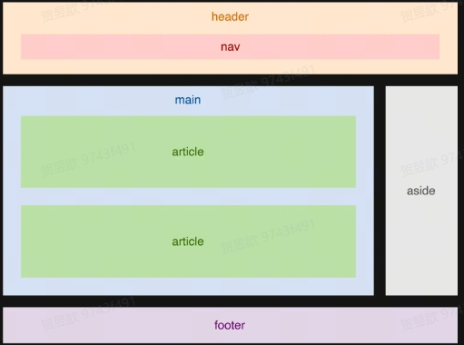

# 前端与HTML

## 前端技术栈

服务器端 <--(网络协议)--> 前端：JavaScript（行为）、CSS（样式）、HTML（内容）

```html
<!doctype html> //文档类型，网页根据这个渲染整个页面
<html>//根目录
    <head>
        <meta charset="utf-8">//编码格式
        <title>我的第一个网页</title>//网页标题
    </head>
    <body>
        <h1>我的第一个网页</h1>
        <p>我的第一个段落</p>
    </body>
</html>
```

## HTML语法

* 标签和属性不区分大小写，推荐使用小写
* 空标签可以不闭合，比如input、meta
* 属性值推荐使用双引号包裹
* 某些属性值可以省略，比如required、readonly

### HTML列表

* 有序列表：ol
* 无序列表：ul
* 自定义列表：dl

```html
<dl>
<dt>Coffee</dt>
<dd>- black hot drink</dd>
<dt>Milk</dt>
<dd>- white cold drink</dd>
</dl>
```

### 链接

* target：定义链接的打开方式。
_blank: 在新窗口或新标签页中打开链接。
_self: 在当前窗口或标签页中打开链接（默认）。
_parent: 在父框架中打开链接。
_top: 在整个窗口中打开链接，取消任何框架。

```html
<a href="https://www.example.com" target="_blank" rel="noopener">新窗口打开 Example</a> 

普通的链接：<a href="http://www.example.com/">链接文本</a>
图像链接： <a href="http://www.example.com/"></a>
邮件链接： <a href="mailto:webmaster@example.com">发送e-mail</a>
书签：
<a id="tips">提示部分</a>
<a href="#tips">跳到提示部分</a>
```

### HTML表单

```html
<input type="text" name="email" size="40" maxlength="50">
<input type="password">
<input type="checkbox" checked="checked">
<textarea name="comment" rows="60" cols="20"></textarea>

<p>
    <label><input type="checkbox" />🍎<label>
    <label><input type="checkbox" />🍌<label>
    <label><input type="checkbox" />🍓<label>
</p>//复选框,可以使用label标签包裹input标签，这样可以让用户点击标签而不是input框来选择；可以选多个

<p>
    <label><input type="radio" name="sex" />男</label>
    <label><input type="radio" name="sex" />女</label>
</p>//单选框，只能选一个;通过name属性来区分，name相同的单选框只能选一个

<p>
    <select>
        <option>苹果</option>
        <option>香蕉</option>
        <option>樱桃</option>
    </select>
</p>//下拉框

<input list="countries" />
<datalist id="countries">
    <option value="中国"></option>
    <option value="美国"></option>
    <option value="英国"></option>
</datalist>//自动补全，通过list属性来关联datalist，通过value属性来设置选项
```

### 引用

* 引用：q // 引用内联文本，和cite的区别在于，q标签是内联元素，cite是块级元素；内联文本是指在一行内显示的文本，块级文本是指在一行内无法显示的文本
* 引用块：blockquote // 引用块级文本
* 引用来源：cite // 一般用于引用来源，比如文章来源、歌曲来源、电影来源等
* 引用时间：time 
* 引用代码：code // 引用代码

### 内容划分



w3c,mdn 看每一个标签和每一个含义